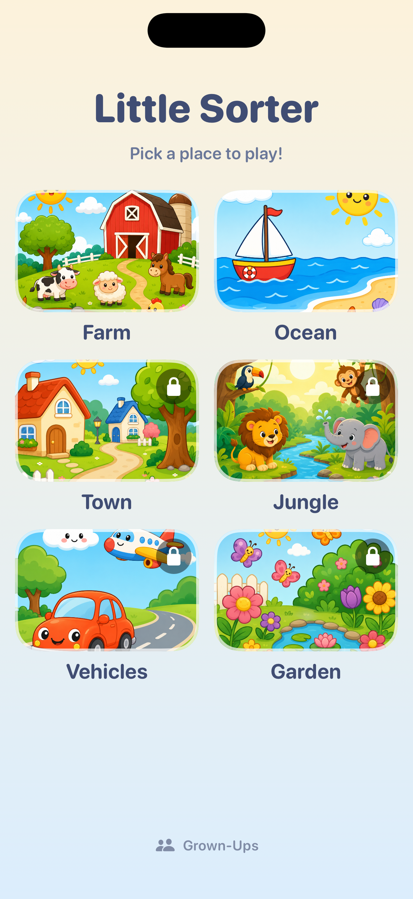
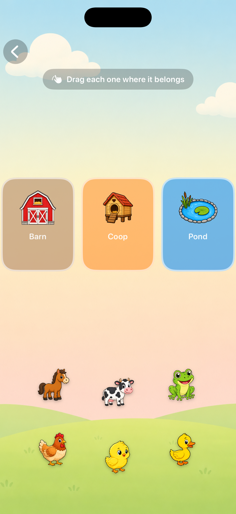
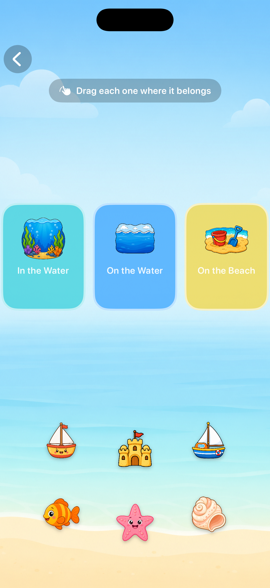
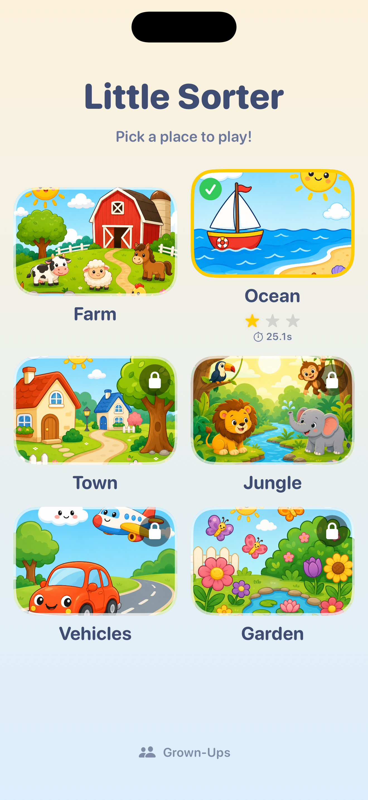
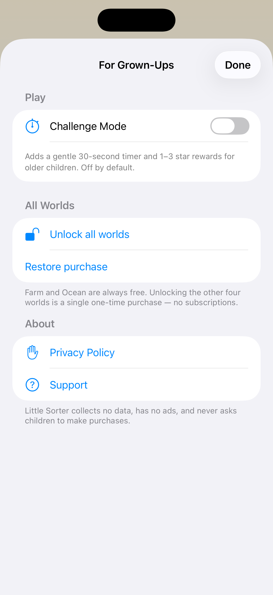
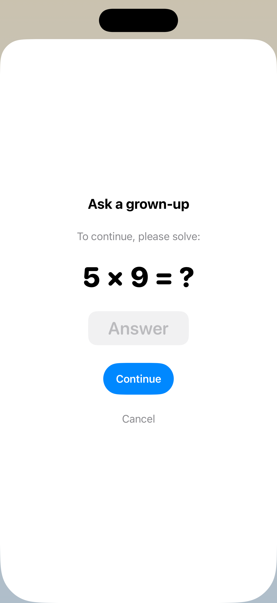

# 🦊 Little Sorter

### A calm, ad-free sorting &amp; matching game for toddlers — ages 2–5

  
  
  
  
  
  
  

  
  
  

---

## ✨ Overview

**Little Sorter** is a gentle drag-and-sort game built for the smallest hands. A child drags each thing to where it belongs — a cow to the barn, a duck to the pond, a boat onto the water — and every correct match is welcomed with a soft chime, a friendly spoken word, and a happy little burst of color.

There are no buzzers, no losing, and no harsh "wrong." A misplaced piece simply floats back so a toddler can try again, happily. It's designed to be a quiet, proud-making corner of the iPhone or iPad — built to Apple's **Kids Category** standards.

## 🎮 Features

- 🌍 **Six playful worlds** — Farm and Ocean are free; the other four unlock with a single one-time purchase (no subscriptions).
- 🧸 **Forgiving, mistake-proof play** — a wrong drop just floats back with a soft nudge; nothing punishes a small child.
- 🗣️ **Spoken item names** for pre-readers, fully on-device.
- 🎉 **Themed celebrations** — a particle burst tuned per zone (splash, feathers, leaves, petals, and more) plus per-world music.
- ⏱️ **Optional Challenge Mode** — a gentle 30-second timer with 1–3 star rewards. Off by default, and only reachable by a grown-up behind a parental gate.
- 🔒 **Privacy-first** — no ads, no tracking, no accounts, no analytics, no networking. Collects **zero** data.

## 🌍 The Six Worlds

| World | Sort by | Access |
|:------|:--------|:------:|
| 🐄 **Farm** | where each animal lives — barn, coop, pond | Free |
| 🐠 **Ocean** | in the water, on the water, on the beach | Free |
| 🚗 **Town** | road, home, playground | Unlock |
| 🐯 **Jungle** | habitat layer — trees, ground, river | Unlock |
| ✈️ **Vehicles** | how it travels — road, water, air | Unlock |
| 🐞 **Garden** | where each bug lives — dirt, leaves, flowers | Unlock |

## 📸 More Screens

  
  
  

## 🛠️ Built With

- **SwiftUI** (iOS 17.6+), universal — iPhone &amp; iPad
- **StoreKit 2** for the one-time non-consumable unlock
- **AVFoundation** — runtime-synthesized chimes, on-device speech, and looping per-world music
- Persistence via **`@AppStorage`** (UserDefaults)
- **No third-party dependencies** — 100% Swift, asset-light

## 🏗️ Architecture

A clean two-screen state machine drives the whole app, with audio, effects, and the store cleanly separated.

| File | Responsibility |
|:-----|:---------------|
| `LittleSorterApp.swift` | App entry + the menu ⇄ gameplay state machine |
| `Models.swift` | The six worlds, zones, items, and content validation |
| `GameView.swift` | Drag-and-sort gameplay, timer, celebration |
| `LevelPickerView.swift` | The world picker |
| `GrownUpsView.swift` · `ParentalGate.swift` · `PaywallView.swift` | The adult-only area |
| `Store.swift` | StoreKit 2 wrapper |
| `DropEffectView.swift` · `ConfettiView.swift` | Asset-free particle effects |
| `ToneManager.swift` · `SpeechManager.swift` · `MusicManager.swift` | Audio |

## 🔒 Privacy

Little Sorter collects no data, contains no advertising, makes no network requests, and never asks a child to make a purchase. All progress is stored only on the device. Purchases and external links live exclusively behind a parental gate.

## 🚀 Running It

1. Open `LittleSorter.xcodeproj` in **Xcode 26+**.
2. Select the **LittleSorter** scheme and an iPhone or iPad simulator.
3. Build &amp; run (**⌘R**). The bundled `Products.storekit` config lets you test purchase and restore locally — no App Store Connect needed.

---

**Made with care for little ones.**

© 2026 Ethan Irimiciuc · All rights reserved.

